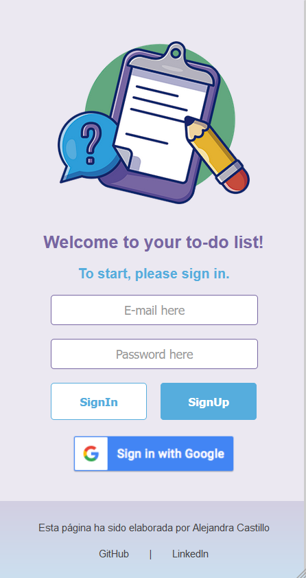

# ToDo-List | Lista de Tareas
## ¡Crea tu lista de tareas!

SPA (ruteado) que utiliza Firebase V9 (Firebase Auth y Firestore)
- El usuario puede crear una cuenta e iniciar sesión con correo electrónico, o su cuenta de Google.
- Si el usuario inició sesión con Google, entonces verá su nombre de usuario, de lo contrario visualizará su correo electrónico.
- Puede crear tareas, editarlas y eliminarlas.
- Las tareas se ordenan según la fecha de creación.
- Se puede visualizar la fecha y hora de creación.

